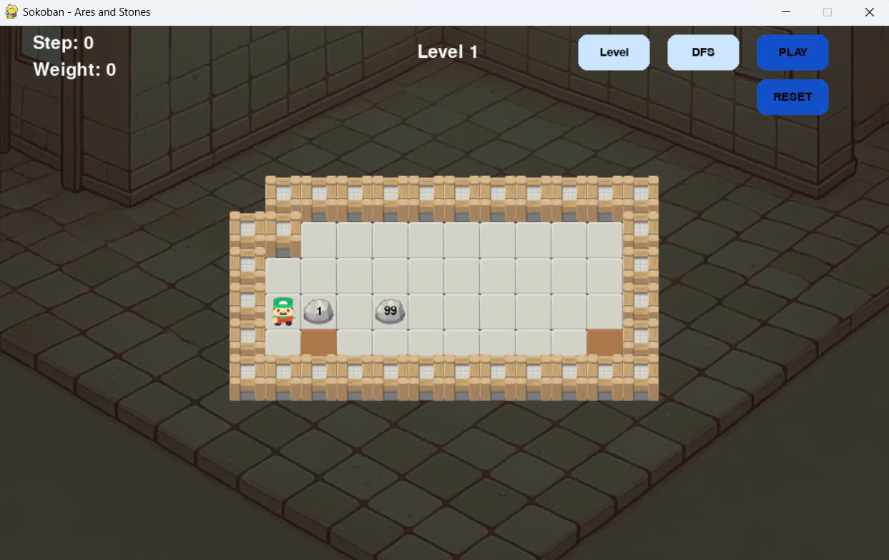
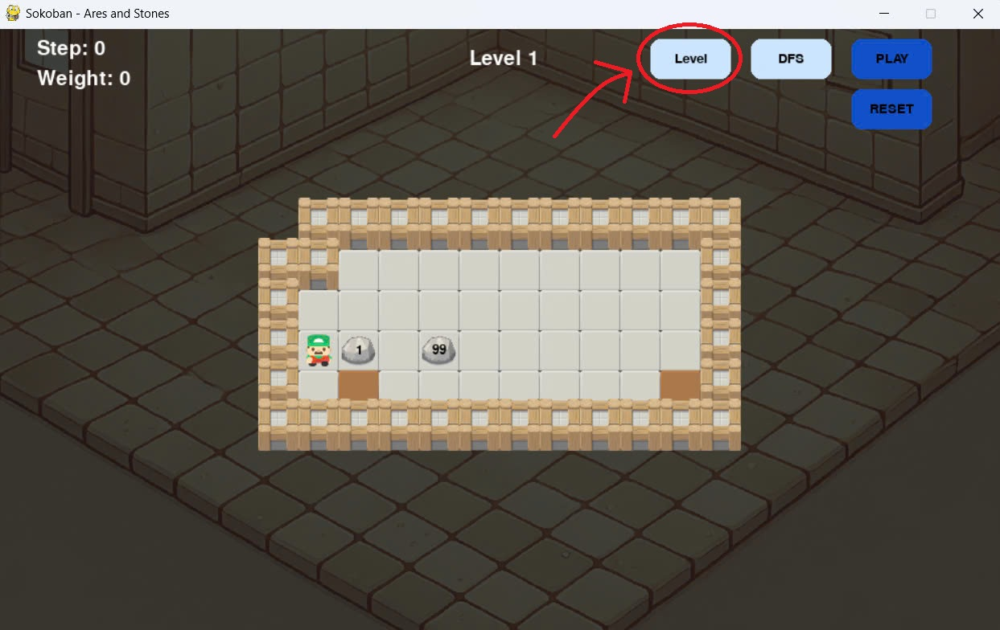
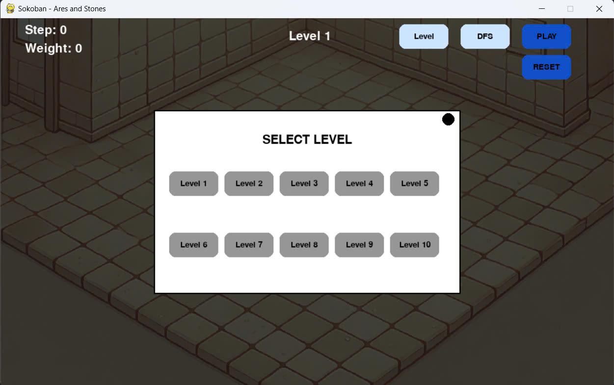
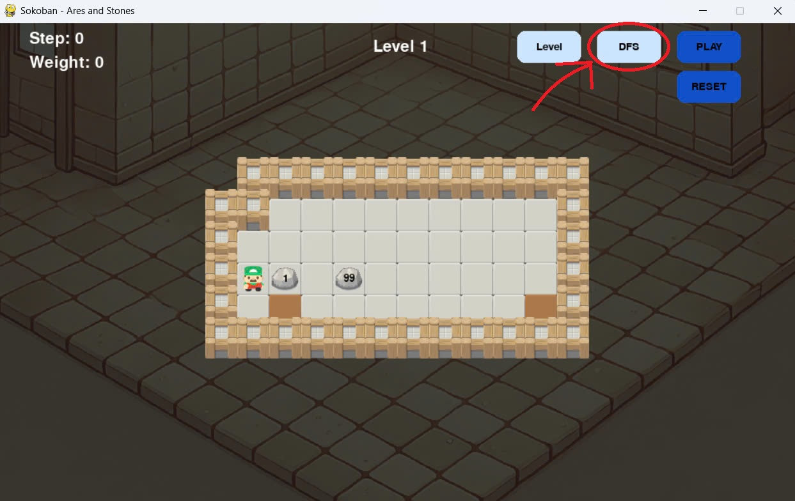
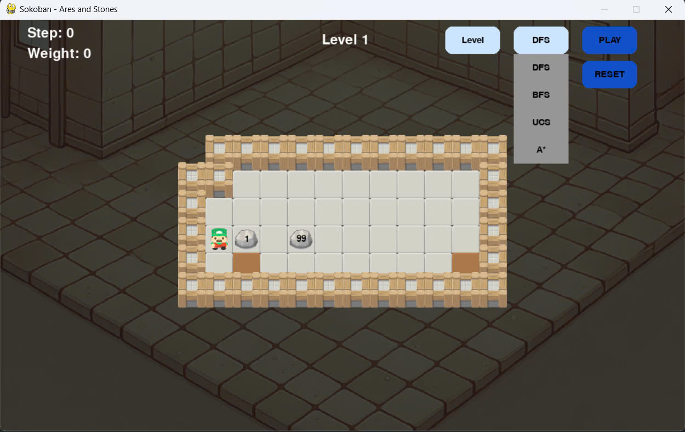
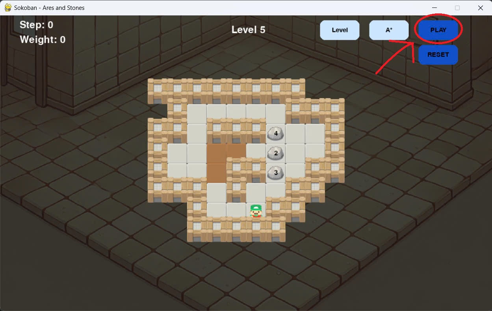
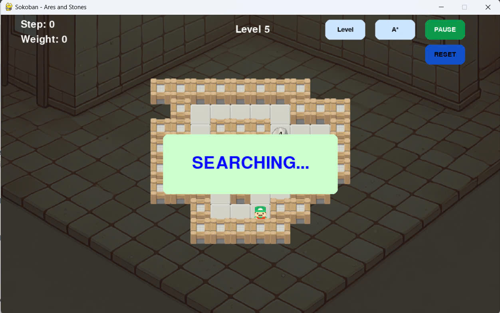
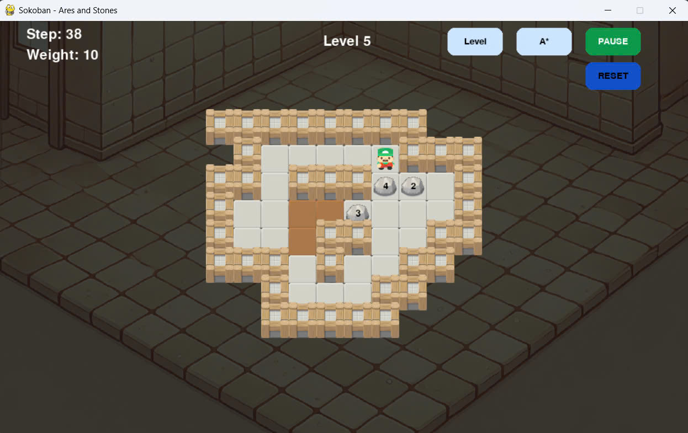
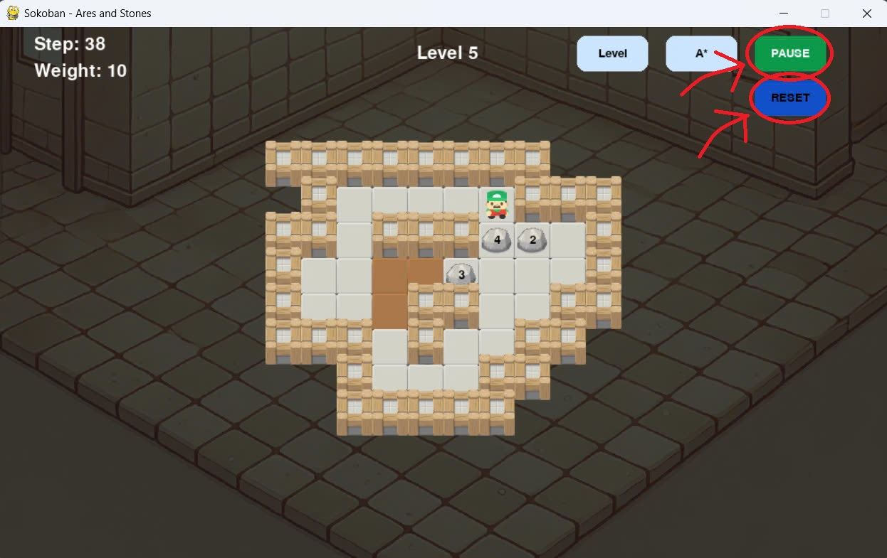
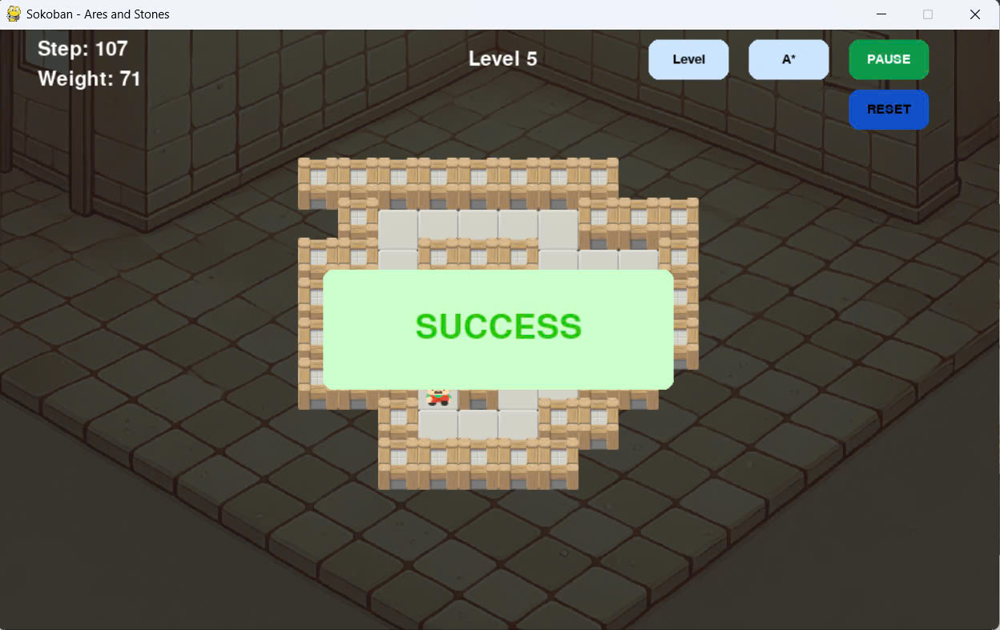

# Sokoban - Ares Adventure

## Table of Contents
- [Introduction](#introduction)
- [Project Structure](#project-structure)
- [Installation](#installation)
- [Usage](#usage)

## Introduction
In this project, we developed a Sokoban game using Pygame, featuring a character named Ares who can automatically solve puzzles of varying difficulty levels. The game integrates four different pathfinding algorithms (DFS, BFS, UCS, and A*) to navigate through complex maps. Each algorithm offers unique approaches to finding solutions, allowing Ares to efficiently tackle puzzles from easy to challenging levels.

## Project Structure
```power shell
├── algorithms
│   ├── __init__.py
│   ├── astar.py
│   ├── bfs.py
│   ├── dfs.py
│   └── ucs.py
├── config
│   ├── ImageConfig.py
│   ├── UIConfig.py
│   └── __init__.py
├── img
│   ├── ares.png
│   ├── bg.png
│   ├── bg.webp
│   ├── bg2.png
│   ├── bg2.webp
│   ├── freespace.png
│   ├── stone.png
│   ├── switch.png
│   └── wall.png
├── requirements.txt
├── utils
│   ├── Action.py
│   ├── Alert.py
│   ├── Ares.py
│   ├── Button.py
│   ├── FreeSpace.py
│   ├── GameGraphic.py
│   ├── GameObject.py
│   ├── LevelButton.py
│   ├── Object.py
│   ├── PlayButton.py
│   ├── ResetButton.py
│   ├── Stone.py
│   ├── Switch.py
│   ├── Utilities.py
│   ├── Wall.py
│   └── __init__.py
├── input-02.txt
├── input-03.txt
├── input-04.txt
├── input-05.txt
├── input-06.txt
├── input-07.txt
├── input-08.txt
├── input-09.txt
├── input-10.txt
├── main.py
```

## Installation
1. Clone the repository
```power shell
git clone https://github.com/tuongkhtn/Ares-Adventure
cd Ares-Adventure
```
2. Create and activate a virtual environment
```power shell
python -m venv myenv
source myenv/bin/activate  # On Windows: myenv\Scripts\activate
```
3. Install dependencies
```power shell
pip install -r requirements.txt
```

## Usage
1. Run the application
```power shell
python main.py
```
2. This is the interface of the application


3. You can select level by clicking the Level button

<br />
Then, the level selection screen will appear.

<br />
Let's choose the level you want.

4. You can select the algorithm by clicking the Algorithm button


<br />
Let's choose the algorithm you want.

5. Click the Play button to let Ares solve this map

<br />
After clicking the play button, Ares begins to find a path according to the selected algorithm.

<br />
After finding the path, Ares will run to push stones to switches. You can see step count and total weight at the top left of the screen.

<br />
While Ares is running, you can press the Pause button to stop Ares or press the Reset button to restart Ares from the beginning.

<br />
After Ares pushes all stones to switches, the screen will display a success message.
